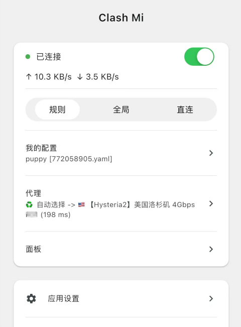

<h1 align="center">
  
   
  Clash Mi - 又一款mihomo核心的简单代理工具
   
</h1>

<h3 align="center">
基于 <a href="https://github.com/flutter/flutter">flutter</a> 的 <a href="https://github.com/MetaCubeX/mihomo">mihomo(clash.meta)</a> 图形用户界面。
</h3>

### 注意: ClashMi或KaringX未在任何视频平台开设过任何频道
## 特点
- 内置Mihomo内核
    - 基于最新且持续更新的Mihomo(Clash.Meta)内核. 内核及客户端均持续更新维护，放心使用.
- 操作简单
    - 支持metacubex的推荐配置, 内核基于yaml配置运行. 小白用户使用机场订阅即可使用.
- 自带[zashboard面板](https://github.com/Zephyruso/zashboard)
    - web面板 或许你更加熟悉.
- 用户手册: [clashmi.app](https://clashmi.app)

## 推广

查看所有推广

### ✈️推荐机场

[🐶狗狗加速 —— 技术流机场 Doggygo VPN](https://1.x31415926.top/redir.html?url=aHR0cHM6Ly93d3cuZGc2LnRvcC8jL3JlZ2lzdGVyP2NvZGU9bEZINGlpOUQ=&i=3eb&t=1723644053)

- 高性能海外机场，海外团队，无跑路风险
- 专属链接注册送 3 天，每天 1G 流量 [免费试用](https://1.x31415926.top/redir.html?url=aHR0cHM6Ly93d3cuZGc2LnRvcC8jL3JlZ2lzdGVyP2NvZGU9bEZINGlpOUQ=&i=3eb&t=1723644053)
- 优惠套餐每月仅需 15.8 元，160G 流量，年付 8 折
- 全球首家支持`Hysteria2` 协议，集群负载均衡设计，高速专线，极低延迟，无视晚高峰，4K 秒开
- 解锁流媒体及 ChatGPT

[👉更多机场优惠 每日更新](https://1.x31415926.top/)

### 🤝机场合作招募
- 👉[联系方式与合作形式](https://karing.app/blog/isp/cooperation)👈

## 系统要求

- IOS >= 15
- MacOS >= 12
- TvOS >= 17
- Android >= 8  (arm64-v8a, armeabi-v7a)
- Windows >= 10 （仅支持64位）

## 安装
- **IOS/MacOS/TvOS AppStore**: （搜索关键词：clash mi）
  - https://apps.apple.com/us/app/clash-mi/id6744321968
- **IOS/MacOS/TvOS TestFlight**:
  - https://testflight.apple.com/join/bjHXktB3
- **Android**:
  - https://github.com/KaringX/clashmi/releases/latest
- **Windows**:
  - https://github.com/KaringX/clashmi/releases/latest

### 常见问题

> [FAQ|cn](https://clashmi.app/guide/faq)

## 截图

  
    

## 提交需求/bug
- [欢迎报告bug及需求！](https://github.com/KaringX/clashmi/issues)
- [ClashMiApp 电报群](https://t.me/ClashMiApp)

## 捐赠
- [请开发者喝一杯](https://clashmi.app/donate)

## 致谢
Clash Mi 基于或受到这些项目的启发：

- [flutter](https://flutter.dev/)：使构建美观应用变得轻松快捷.
- [mihomo](https://github.com/MetaCubeX/mihomo)：另一款 clash核心.
- [zashboard](https://github.com/Zephyruso/zashboard): 使用 Clash API 的仪表板.

